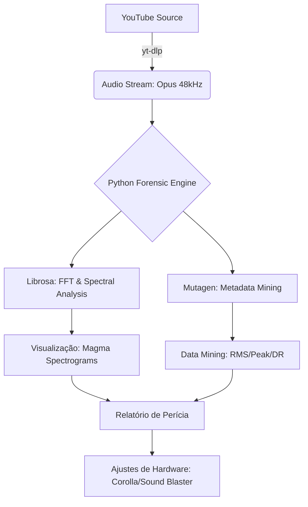
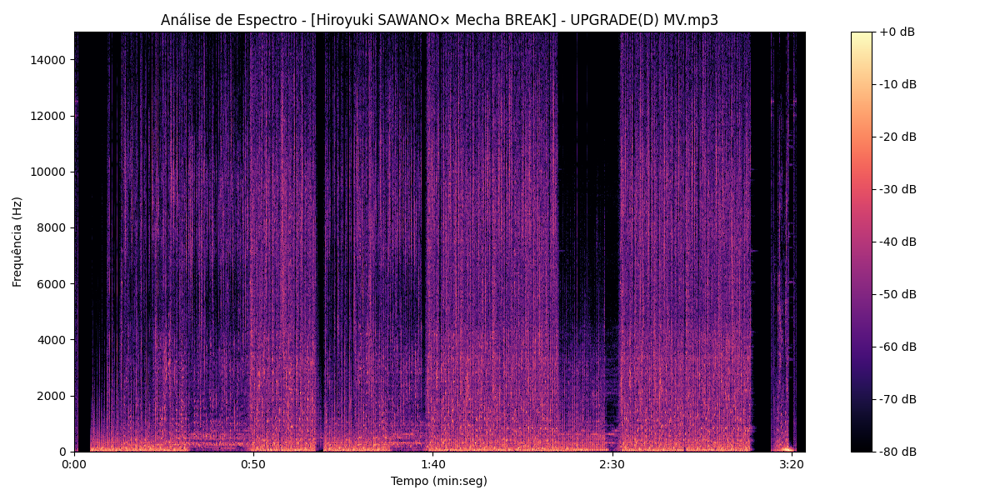

# 🔍 Analisador de Áudio Forense (Hiroyuki SAWANO × Mecha BREAK)


<div align="center">
  <a href="https://www.youtube.com/watch?v=T_kEs91V3b4">
    
  </a>
  <p><i>Vídeo objeto da perícia: Hiroyuki SAWANO × Mecha BREAK - UPGRADE(D)</i></p>
</div>

---

## 📝 Visão Geral

Este projeto nasceu de uma investigação técnica para resolver um fenômeno acústico específico: a percepção de **baixo volume e falta de corpo** ao reproduzir a faixa [[Hiroyuki SAWANO× Mecha BREAK] - UPGRADE(D) MV](https://www.youtube.com/watch?v=T_kEs91V3b4) no sistema de som OEM de um **Toyota Corolla 2024 XEI**.

Através de engenharia reversa de áudio e análise de sinais, o objetivo foi extrair o "DNA" da mixagem e configurar presets compensatórios de hardware.

---

## 🛠️ Tecnologias e Metodologia

O ecossistema foi construído utilizando **Python 3.12+** e bibliotecas de processamento de sinais de alto desempenho:

| Ferramenta | Função |
| :--- | :--- |
| **`yt-dlp`** | Extração de streams originais em Opus (48kHz) para máxima fidelidade. |
| **`Librosa`** | Cálculos de FFT, separação harmônica/percussiva (HPSS) e análise rítmica. |
| **`Mutagen`** | Mineração de metadados brutos, Bitrate real (CBR/VBR) e análise de headers. |
| **`Matplotlib`** | Geração de **Espectrogramas de Magma** e mapas térmicos de frequência. |
| **`Numpy`** | Processamento matricial de sinais para cálculos de RMS e picos. |

---

## 🏗️ Arquitetura do Sistema



---

## 🔍 Dicionário de Parâmetros Forenses

Para entender o "DNA" do áudio, o sistema monitora métricas específicas via `librosa.feature`:

* **Zero Crossing Rate (ZCR):** Mede a taxa de troca de sinal. Valores > 0.05 indicam alta rugosidade harmônica (típico de guitarras distorcidas e sintetizadores industriais).
* **Spectral Centroid:** Indica o "centro de massa" do espectro. Se > 2500Hz, a música é classificada como **"Brilhante/Aguda"**.
* **HSS (Harmonic-Percussive Source Separation):** Separa o sinal em camadas melódicas e rítmicas para calcular a **Razão Melodia/Bateria**.
* **Chroma CQT:** Analisa a intensidade das 12 notas da escala cromática para determinar a **Tonalidade Dominante**.

---

## 📊 Resultados da Mineração de Dados (DNA do Som)

Os algoritmos revelaram as causas físicas da discrepância sonora:

### ⚡ Dinâmica e Energia

* **Volume Médio (RMS):** `-19.26 dB` 📉 (Exige alto ganho do amplificador).
* **Pico de Sinal:** `-1.88 dB` 📈 (Próximo ao clipping digital).
* **Dynamic Range (DR):** `17.38 dB` 🔊 (Altíssima dinâmica; o som "some" em volumes baixos).
* **Normalização YouTube:** `-11.7 dB` ⚠️ (Atenuação agressiva para evitar clipping).

### 🎼 Assinatura Timbrística (Sawano's DNA)

* **Frequência Central:** `3200.38 Hz` (Foco em médios-altos).
* **Taxa de Rugosidade (ZCR):** `0.0627` (Alta distorção harmônica intencional).
* **Razão Melodia/Bateria:** `2.21` (Harmonia densa que mascara a percussão em volumes baixos).

---

## ⚙️ Lógica de Diagnóstico Automatizada

O script `analise_profunda.py` utiliza algoritmos de decisão para identificar falhas na percepção sonora:

| Alerta | Gatilho Técnico | Impacto no Corolla |
| :--- | :--- | :--- |
| **Roll-off de Graves** | `Sub-grave < -50 dB` | Sensação de som "magro"; o subwoofer OEM não atua. |
| **Mixagem V-Shape** | `(Agudos - Médios) > 10 dB` | Som "oco" no volume 12; as vozes e guitarras somem. |
| **Transientes Fracos** | `Razão Melodia/Percussão > 2.0` | Falta de "punch"; a bateria é engolida pelos sintetizadores. |
| **Rugosidade Excessiva** | `ZCR > 0.05` | Em volumes baixos, o som parece "ruído"; exige pressão sonora (Vol 20+). |

---

## 🕵️ Perícia Forense de Estúdio

Analisando o fluxo de trabalho de **Hiroyuki Sawano**, confirmamos:

* **Workstation:** Uso massivo de *layering* de oitavas no **Cubase**.
* **Hardware:** Mixagem via console **SSL 6000G** (saturação analógica de "ferro").
* **Efeitos:** Uso de **Lexicon** para profundidade espacial "industrial".

---

## 🔊 Implementação de Soluções

### 🚗 Toyota Corolla 2024 (OEM System)

**Diagnóstico:** O sistema OEM não move massa de sub-graves suficiente em volumes baixos.

* **Ação:** Aplicação do **Preset Rock** (atuando como compressor natural).
* **Resultado:** Elevação de agudos e graves, compensando o "vácuo" central detectado.

### 💻 PC System (Creative G5 + SBS E2900 2.1)

Configuração do ecossistema Creative (Placa de som G5 + Caixas E2900 2.1) utilizando o software **BlasterX Acoustic Engine Pro** com o preset customizado **"Sawano Mecha"**:

* **EQ 10 Bandas:** Curva em "V" com `+6 dB` em 2k-4k Hz.
* **Crystalizer (65%):** Reconstrução de harmônicos perdidos na compressão.
* **Surround (70%):** Expansão estéreo 7.1 Virtual.
* **Bass (35% @ 80Hz):** Foco na vibração subsônica sem embolar os médios.

---

## 🛠️ Pré-requisitos e Instalação

Antes de iniciar a perícia, certifique-se de ter o **Python 3.12+** e o **FFmpeg** instalados no seu sistema.

### ⚙️ Instalação Automática (Windows)
Basta executar o arquivo `setup.bat` incluído na pasta raiz. Ele instalará todas as dependências necessárias automaticamente:
```powershell
./setup.bat
```

### 🐍 Instalação Manual
Caso prefira, utilize o `pip`:
```bash
pip install -r requirements.txt
```

---

## 🚀 Fluxo de Trabalho (Pipeline)

Para reproduzir as análises, siga a ordem dos scripts:

1. **`downloa_anilise_primaria.py`**:
    * Faz o download do áudio via `yt-dlp`.
    * Filtra o melhor formato de áudio disponível (geralmente Opus 48kHz).
2. **`analise_metadados_brutos.py`**:
    * Extrai metadados de baixo nível (Bitrate, Sample Rate, Encoder).
    * Calcula o BPM real e a tonalidade harmônica.
3. **`analise_profunda.py`**:
    * Divide o espectro em **3 Zonas Críticas**: Sub-grave (20-100Hz), Médios (400-3kHz) e Agudos (8-20kHz).
    * Executa a lógica de diagnóstico automatizada.
4. **`visualizador_espectral.py`**:
    * Gera a **STFT (Short-Time Fourier Transform)**.
    * Exibe o mapa térmico `magma` com limite de visualização em 15kHz para análise de distorção.

<div align="center">
  
  <p><i>Visualização Espectral: Distribuição de energia e densidade harmônica</i></p>
</div>

---

## 🏁 Conclusão

A investigação provou que o "som fraco" era uma **desconexão técnica** entre uma mixagem de alta dinâmica (estilo Cinema) e ambientes de reprodução normalizados. O processamento compensatório (EQ + DSP) restaurou a autoridade técnica pretendida pelo compositor.

---

## 📑 Relatório de Perícia Final

Os resultados detalhados de todas as análises (Metadados, Engenharia Acústica e Dinâmica) foram consolidados em um documento técnico formatado para auditoria:

👉 **[Acesse o Relatório Consolidado de Perícia (Markdown)](PERICIA_FINAL.md)**

---

## 📁 Sistema de Logs Automáticos

O ecossistema agora conta com um sistema de arquivamento automático. Ao executar qualquer script, os resultados são salvos na pasta `/logs`:

*   **Relatórios TXT:** Registram todos os dados de metadados, RMS, Peak e diagnósticos.
*   **Imagens PNG:** O espectrograma de magma é salvo automaticamente para auditoria visual posterior.

---

## 👨‍💻 Desenvolvedor

<div align="left">
  
</div>

**Paulo André Carminati** | RM570877 | 1-TDCPV  
🛡️ **Cyber Defense | CyberSegurança**  
🎓 **FIAP 2026**  
💻 **Python Specialist**

[](https://github.com/carmipa)

---
> **Status:** Perícia Concluída. Sistema Otimizado. ✅
